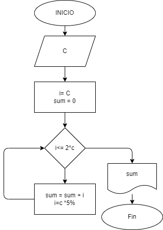

# Interes_compuesto
Hacer el diagrama y programa en python, que lea un capital c. y que averigüe e imprima en cuantos meses se duplica si lo colocamos a interés compuesto del 5% mensual.
## Diagrama de flujo

(diagrama de flujo)